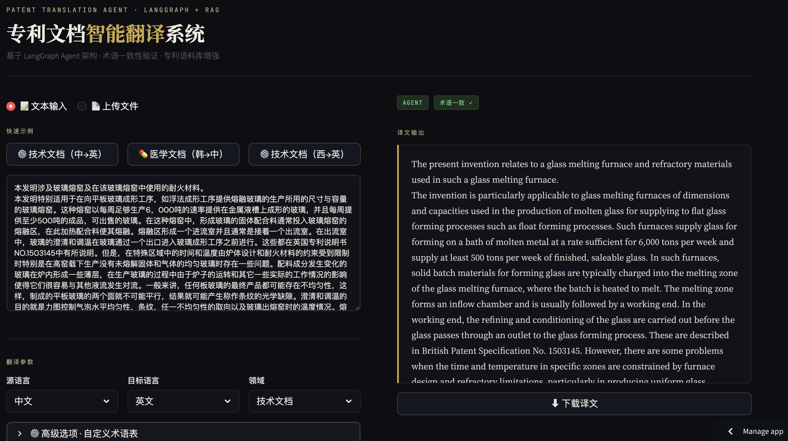

# Patent Translation Agent | 专利文档翻译智能体

> 面向知识产权垂直领域的长文档翻译系统，基于 **LangGraph Agent** 架构实现术语提取、并行翻译、一致性验证的完整 Tool-Use 闭环。
> 外部术语库注入保证全文术语 **100% 一致性**，8K 字符文档 **6 分钟**内处理完成；Pipeline 层作为降级容错保障，异常路径下自动切换，确保系统在任意故障模式下稳定输出。


[](https://patent-translation-m5m8cgguvtk8fzw6gkeu2q.streamlit.app)


## 📁 项目结构

```
patent-translation/
├── agent/
│   ├── state.py               # TranslationState 定义
│   ├── tools.py               # 三个核心 Tool（术语提取/并行翻译/一致性验证）
│   └── graph.py               # LangGraph Orchestrator + 路由逻辑
├── api_server.py              # FastAPI 服务层，7 个 RESTful 端点
├── translation_core.py        # 翻译核心：并行分块 + 语料库加速双分支
├── terminology_extraction.py  # 滑动窗口术语提取 + 双语术语翻译
├── corpus_retrieval.py        # Qdrant 语义检索 + 命中/未命中句子合并
├── utils.py                   # 段落感知分块、Token 估算
├── config.py                  # 统一配置管理（LLM / Qdrant / 翻译参数）
├── corpus/
│   ├── __init__.py
│   ├── embeddings.py          # 文本向量化服务（支持多种 Embedding 模型）
│   └── manager.py             # Qdrant Collection CRUD 管理
├── .env.example               # 环境变量模板
└── requirements.txt
```
## 🏗️ 系统架构
```
输入：文档 + 目标语言 [+ 术语表]
         │
         ▼
┌─────────────────────────────────────────-
│  Orchestrator（LangGraph StateGraph）    │
│  动态调度 Tool，管理状态与重试路由           │
└───┬─────────────┬──────────────┬────────┘
    ▼             ▼              ▼
┌────────┐  ┌──────────┐  ┌──────────┐
│ Tool 1 │  │  Tool 2  │  │  Tool 3  │
│ 术语提取│→ │ 并行翻译   │→ │ 一致性    │
│滑动窗口 │  │3线程+RAG  │  │   验证    │
│术语注入 │  │Qdrant加速 │  │          │
└────────┘  └──────────┘  └──────────┘
                                │
                    ┌───────────┴──────────┐
                    ▼                      ▼
             [验证通过 → END]    [失败 → 重试/Pipeline降级]
                                           │
                               ┌───────────┘
                               ▼
                    ┌─────────────────────┐
                    │  Pipeline Fallback  │
                    │  （降级容错保障）      │
                    └─────────────────────┘
```

## ⚙️ 核心模块功能

| 模块 | 说明 |
|------|------|
| **LangGraph Orchestrator** | 基于 StateGraph 编排三个 Tool，验证失败自动重试（上限 3 次），超限降级至 Pipeline |
| **Pipeline Fallback** | 异常路径下调用原 Pipeline，保证系统在任意故障模式下稳定输出 |
| **滑动窗口术语提取** | 窗口 8000 字符 / 重叠 2000 字符，跨窗口频率统计解决长文档术语覆盖不全问题 |
| **语言自适应术语去重** | 中文使用字符边界匹配，英文使用 \b 单词边界，避免正则对中文失效 |
| **精确匹配优先的术语注入** | 每 chunk 注入上限 25 条，精确命中优先 + 频率保底，避免全量注入稀释 LLM 注意力 |
| **RAG 语料库加速** | 命中句子（阈值 0.85）直接复用历史译文，未命中送 LLM，减少重复 API 调用 |


## 🔧 翻译引擎

兼容 OpenAI 格式 API，支持多种部署方式：

| 部署方式 | 适用场景 | 说明 |
|---------|---------|------|
| 本地 vLLM 部署 | **推荐**，数据不出本地 | 实测 Qwen2.5-14B-AWQ（RTX 4090），AWQ 量化较 FP16 显存降低 50% |
| 云服务器自部署 | 数据隐私要求高、无本地 GPU | 项目初期采用，隐私可控但成本较高 |
| DeepSeek / GPT-4o 等云端 API | 快速接入、无部署成本 | 适合评估阶段，需注意数据出境合规 |

> 项目实际经历了云服务器自部署 → DeepSeek API → 本地部署的演进，
> 驱动因素依次是：初期隐私优先、中期成本压力、长期推荐本地部署兼顾三者。

## 🎯 在线 Demo

[](https://patent-translation-m5m8cgguvtk8fzw6gkeu2q.streamlit.app)

> 提供三个预置专利片段（`中-英` 技术文档 / `韩-中` 医学文档 / `西-英` 技术文档），点击示例按钮即可一键运行，无需配置。



## 🚀 Quick Start

**环境要求**：Python 3.9+ | OpenAI 兼容 API（vLLM / DeepSeek 等）
**可选**：Qdrant（启用 RAG 语料库加速时需要）
```bash
# 1. 克隆仓库
git clone https://github.com/edgetalker/Patent-translation.git
cd Patent-translation

# 2. 安装依赖
pip install -r requirements.txt

# 3. 配置环境变量
cp .env.example .env
# 编辑 .env，填写 LLM_BASE_URL / API_KEY / QDRANT_HOST

# 4. 启动服务
python api_server.py

# 5. 验证服务
curl http://localhost:8080/health
```

## 📊 性能指标

### 处理速度（无语料库基准）

| 文档规模 | 实测耗时 | 吞吐量 |
|---------|---------|--------|
| 8K 字符（2 chunks）  | 5.85 min | ~24 chars/s |
| 40K 字符（7 chunks） | 8.43 min | ~80 chars/s |
| 20K 字符（线性外推） | ~4.2 min | — |

> 测试文档：玻璃熔窑专利（8,469 字符）、药物化合物专利（40,564 字符），
> 均为真实中文专利文档，无外部术语库输入。

> 吞吐量随文档规模提升，因为 3 线程并行效率随 chunk 数增加而改善。
> 语料库命中后跳过 LLM 调用，预计可进一步缩短处理时间（待实测补充）。

### 术语质量

| 场景 | 术语提取完整率 | 一致性保证方式 |
|------|--------------|--------------|
| 用户提供外部术语库（主场景） | 98.3%–100% | 由术语库直接保证，100% 一致 |
| 无术语库自动推断（降级场景） | 98.3%–100% | LLM 推断，96.7%–100% 一致 |

> 滑动窗口负责在原文中**定位**术语位置，译文优先从外部术语库检索注入；
> 无术语库时由 LLM 自动推断，同形异义术语（如"回流"在流体力学/有机化学中含义不同）是已知局限。

## 🗺️ Roadmap

**已完成**
- [x] 滑动窗口术语提取 + 语言自适应去重
- [x] 精确匹配优先的术语注入策略（上限 25 条）
- [x] RAG 语料库加速（Qdrant + 并行翻译）
- [x] FastAPI 7 模块 RESTful 服务
- [x] Agent 化重构：Pipeline 各阶段封装为独立 Tool（LangGraph）
- [x] Orchestrator 层：动态路由、重试机制、Pipeline 降级容错
- [x] Streamlit 在线 Demo（支持文件上传 / 预置示例 / 自定义术语表）

**计划中**
- [ ] 语料库数据完善：持续收集专利双语语料，完善 RAG 加速链路实测数据
- [ ] Dify 插件封装：将翻译模块发布至 Dify 插件生态，实现零配置即插即用
- [ ] MoE 微调：基于专利领域数据进行监督微调

## 📖 完整 API 文档

启动服务后访问 `http://localhost:8080/docs` 查看交互式文档

详细参数说明见 [docs/API.md](./docs/API.md)