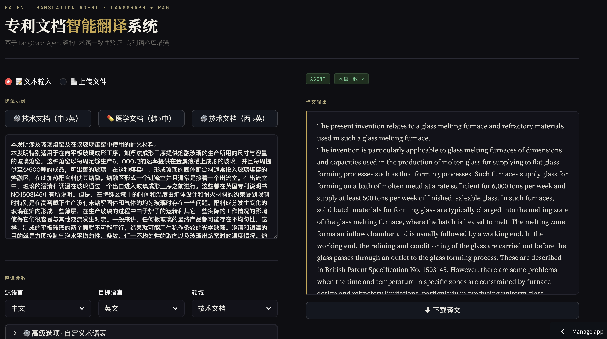

# Patent Translation Agent | 专利文档翻译智能体

> 面向知识产权垂直领域的长文档翻译系统，基于 **LangGraph Agent** 架构实现术语提取、并行翻译、一致性验证的完整 Tool-Use 闭环。
> 外部术语库注入保证全文术语 **100% 一致性**，8K 字符文档 **6 分钟**内处理完成；Agent 层支持**并行分块/术语提取、失败 Chunk 自动修复、术语一致性自纠错循环、跨调用术语记忆**。


[](https://patent-translation-m5m8cgguvtk8fzw6gkeu2q.streamlit.app)


## 📁 项目结构

```
patent-translation/
├── agent/
│   ├── state.py               # TranslationState 定义（含 Agent 控制/循环/记忆字段）
│   ├── tools.py               # 核心 Tool（分块/术语提取/RAG/并行翻译/修复/统计）
│   ├── graph.py               # LangGraph Orchestrator + 条件路由/自纠错循环
│   └── memory.py              # LangGraph Checkpointer 封装（MemorySaver）
├── api_server.py              # FastAPI 服务层，Agent 2.1 接口
├── translation_core.py        # 翻译核心：动态上下文预算 + 修复模式
├── terminology_extraction.py  # 滑动窗口术语提取 + 双语术语翻译
├── corpus_retrieval.py        # Qdrant 语义检索 + 命中/未命中句子合并
├── retrieval_service.py       # 批量预检索服务
├── utils.py                   # 段落感知分块、Token 估算、动态上下文预算
├── config.py                  # 统一配置管理（LLM / Agent 行为 / Qdrant / 翻译参数）
├── corpus/
│   ├── __init__.py
│   ├── embeddings.py          # 文本向量化服务（支持多种 Embedding 模型）
│   └── manager.py             # Qdrant Collection CRUD 管理
├── .env.example               # 环境变量模板
└── requirements.txt
```

## 🏗️ 系统架构

```
输入：文档 + 目标语言 [+ 术语表] [+ thread_id / use_memory]
                    │
                    ▼
            ┌───────────────┐
            │    fanout     │
            └───────┬───────┘
                    │
        ┌───────────┴───────────┐
        ▼                       ▼
   ┌─────────┐            ┌────────────┐
   │  chunk  │            │ term_extract│
   │  分块   │            │  术语提取   │
   └────┬────┘            └──────┬─────┘
        │                        │
        └───────────┬────────────┘
                    ▼
            ┌───────────────┐
            │    retrieve   │  Qdrant 预检索
            └───────┬───────┘
                    ▼
            ┌───────────────┐
            │ parallel_trans│  3 线程并行翻译
            └───────┬───────┘
                    │
        ┌───────────┴───────────┐
        │  failed_chunks?       │
        ▼                       ▼
   ┌───────────┐          ┌──────────┐
   │repair_trans│          │  stats   │ 术语一致性统计
   │ 失败修复  │          └────┬─────┘
   └─────┬─────┘               │
         └─────────────────────┘
                              │
                  consistency_rate < threshold?
                              │
                    ┌─────────┴──────────┐
                    ▼                    ▼
              ┌─────────────┐       ┌─────────────┐
              │ prepare_retry│       │format_output│
              │ 自纠错重试  │       │ 输出格式化  │
              └──────┬──────┘       └──────┬──────┘
                     │                     │
                     └──────────┬──────────┘
                                ▼
                              parallel_trans
                              （循环，最多 max_iterations 次）
```

## ⚙️ 核心模块功能

| 模块 | 说明 |
|------|------|
| **LangGraph Orchestrator** | 基于 StateGraph 编排 6+ 个节点；`chunk` 与 `term_extract` 并行执行；`parallel_trans` 失败自动路由到 `repair_trans`；`stats` 后通过条件边实现术语一致性自纠错循环 |
| **动态上下文预算** | 根据模型上下文窗口、chunk 长度、术语表规模，运行时分配 `max_chunk_chars` / `max_inject_terms` / `max_few_shots`，替代硬编码常量 |
| **失败 Chunk 自动修复** | `parallel_trans_tool` 返回 `failed_chunks`，`repair_trans_tool` 单线程、关闭 few_shots 重试修复 |
| **术语一致性自纠错** | `stats_tool` 计算 `consistency_rate`；低于阈值时生成 `feedback_prompt` 并循环回 `parallel_trans`，默认最多 2 次 |
| **跨调用术语记忆** | 通过 LangGraph `MemorySaver` Checkpointer 按 `thread_id` 持久化 `terminology_memory`，后续请求自动合并历史术语 |
| **滑动窗口术语提取** | 窗口 8000 字符 / 重叠 2000 字符，跨窗口频率统计解决长文档术语覆盖不全问题 |
| **精确匹配优先的术语注入** | 每 chunk 注入上限 25 条（可被动态预算覆盖），精确命中优先 + 频率保底 |
| **RAG 语料库加速** | 命中句子（阈值 0.85）直接复用历史译文，未命中送 LLM，减少重复 API 调用 |

## 🔧 翻译引擎

兼容 OpenAI 格式 API，支持多种部署方式：

| 部署方式 | 适用场景 | 说明 |
|---------|---------|------|
| 本地 vLLM 部署 | **推荐**，数据不出本地 | 实测 Qwen2.5-14B-AWQ（RTX 4090），AWQ 量化较 FP16 显存降低 50% |
| 云服务器自部署 | 数据隐私要求高、无本地 GPU | 项目初期采用，隐私可控但成本较高 |
| DeepSeek / GPT-4o 等云端 API | 快速接入、无部署成本 | 适合评估阶段，需注意数据出境合规 |

> 项目实际经历了云服务器自部署 → DeepSeek API → 本地部署的演进，
> 驱动因素依次是：初期隐私优先、中期成本压力、长期推荐本地部署兼顾三者。

## 🎯 在线 Demo

[](https://patent-translation-m5m8cgguvtk8fzw6gkeu2q.streamlit.app)

> 提供三个预置专利片段（`中-英` 技术文档 / `韩-中` 医学文档 / `西-英` 技术文档），点击示例按钮即可一键运行，无需配置。



## 🚀 Quick Start

**环境要求**：Python 3.9+ | OpenAI 兼容 API（vLLM / DeepSeek 等）
**可选**：Qdrant（启用 RAG 语料库加速时需要）
```bash
# 1. 克隆仓库
git clone https://github.com/edgetalker/Patent-translation.git
cd Patent-translation

# 2. 安装依赖
pip install -r requirements.txt

# 3. 配置环境变量
cp .env.example .env
# 编辑 .env，填写 LLM_BASE_URL / API_KEY / QDRANT_HOST / EMBED_BASE_URL

# 4. 启动服务
python api_server.py

# 5. 验证服务
curl http://localhost:8080/health
```

## 📊 性能指标

### 处理速度（无语料库基准）

| 文档规模 | 实测耗时 | 吞吐量 |
|---------|---------|--------|
| 8K 字符（2 chunks）  | 5.85 min | ~24 chars/s |
| 40K 字符（7 chunks） | 8.43 min | ~80 chars/s |
| 20K 字符（线性外推） | ~4.2 min | — |

> 测试文档：玻璃熔窑专利（8,469 字符）、药物化合物专利（40,564 字符），
> 均为真实中文专利文档，无外部术语库输入。

> 吞吐量随文档规模提升，因为 3 线程并行效率随 chunk 数增加而改善；
> 术语提取与分块并行化后，端到端耗时预计进一步缩短。

### 术语质量

| 场景 | 术语提取完整率 | 一致性保证方式 |
|------|--------------|--------------|
| 用户提供外部术语库（主场景） | 98.3%–100% | 由术语库直接保证，100% 一致 |
| 无术语库自动推断（降级场景） | 98.3%–100% | LLM 推断，96.7%–100% 一致 |

> 滑动窗口负责在原文中**定位**术语位置，译文优先从外部术语库检索注入；
> 无术语库时由 LLM 自动推断，同形异义术语（如"回流"在流体力学/有机化学中含义不同）是已知局限。

## 🗺️ Roadmap

**已完成**
- [x] 滑动窗口术语提取 + 语言自适应去重
- [x] 精确匹配优先的术语注入策略（上限 25 条）
- [x] RAG 语料库加速（Qdrant + 并行翻译）
- [x] FastAPI RESTful 服务
- [x] Agent 化重构：Pipeline 各阶段封装为独立 Tool（LangGraph）
- [x] `chunk` 与 `term_extract` 并行执行
- [x] 失败 Chunk 自动修复节点
- [x] 术语一致性自纠错循环（条件边 + 迭代保护）
- [x] LangGraph Checkpointer 术语记忆
- [x] 动态上下文预算分配
- [x] Streamlit 在线 Demo（支持文件上传 / 预置示例 / 自定义术语表）

**计划中**
- [ ] 语料库数据完善：持续收集专利双语语料，完善 RAG 加速链路实测数据
- [ ] Dify 插件封装：将翻译模块发布至 Dify 插件生态，实现零配置即插即用
- [ ] MoE 微调：基于专利领域数据进行监督微调
- [ ] 将 MemorySaver 替换为持久化 Checkpointer（如 SQLite），实现跨重启术语记忆

## 🧭 架构评估

> 以下评估来自对当前代码的审阅，原文引用以作参考。

**项目能支撑 Agent 面试描述的结论**：
> "可以支撑，但必须要会「诚实包装」。这个项目有 Agent 的骨架（LangGraph + Tool + State + 多步编排），足以作为实习面试的项目载体；但如果把它吹成'自主决策 Agent'或让面试官直接看旧版 README，会有被识破的风险。"

**核心亮点**：
> "使用了真正的 Agent 框架（LangGraph）……做了多步 Tool-Use 流水线……有真实垂直领域问题……有 RAG + 模型上下文编排。"

**已知局限（面试时建议主动提及）**：
> "Graph 是纯线性的，LLM 没有真正'决策'……缺少 Agent 常见的高级能力（memory / human-in-the-loop / evaluation）……翻译一致性验证没有闭环（stats_tool 只做描述性统计）。"

**面试定位建议**：
> "不要说'这是一个自主决策 Agent'，而说'这是一个基于 LangGraph 的 deterministic multi-step agentic workflow，用预定义编排保证翻译流程的稳定和可追溯'。"

## 📖 完整 API 文档

启动服务后访问 `http://localhost:8080/docs` 查看交互式文档

详细参数说明见 [docs/API.md](./docs/API.md)
